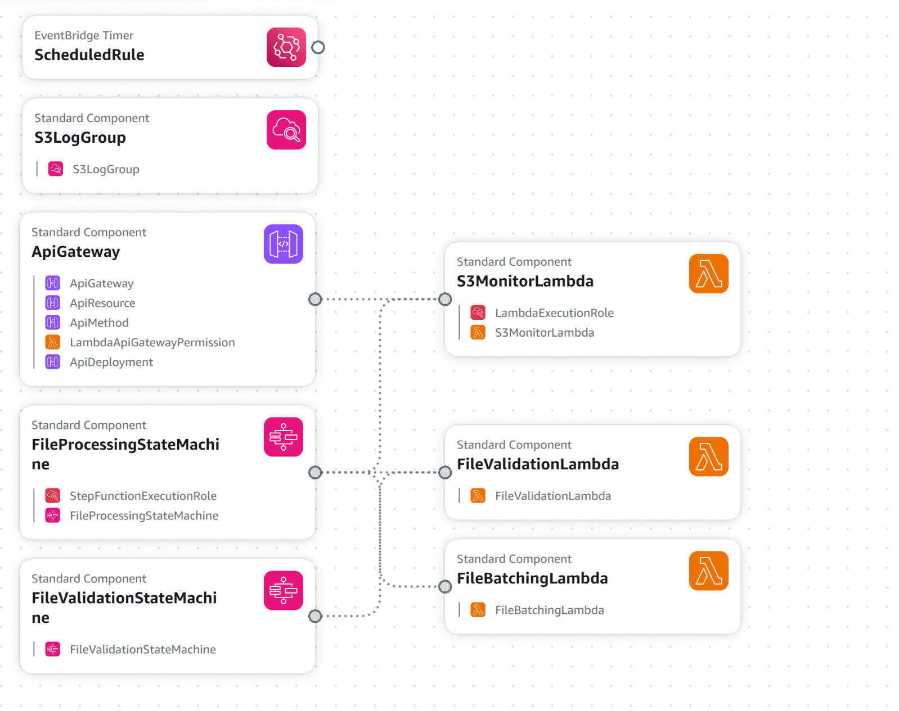

# S3 File Processor - AWS Step Functions Project

A Java-based AWS serverless application that monitors S3 buckets and processes files using Step Functions, Lambda, and API Gateway.

## 🚀 Features

- **Automated S3 Monitoring**: Monitors S3 bucket's `pending/` folder for file threshold
- **Batch Processing**: Automatically moves files to `processing/` folder in configurable batches
- **File Validation**: Validates files for emptiness and other criteria
- **Serverless Architecture**: Uses AWS Lambda, Step Functions, and API Gateway
- **Environment-Specific Deployment**: Supports dev, staging, and production environments
- **Configurable Thresholds**: Customizable file count thresholds and batch sizes
- **REST API**: Exposes endpoints for manual triggering and monitoring

## 🏗️ Architecture

```
┌─────────────────┐    ┌──────────────────┐    ┌─────────────────┐
│   API Gateway   │───▶│  S3 Monitor      │───▶│ Step Function 1 │
│                 │    │  Lambda          │    │ (File Batching) │
└─────────────────┘    └──────────────────┘    └─────────────────┘
                                                        │
┌─────────────────┐    ┌──────────────────┐    ┌─────────────────┐
│ CloudWatch      │───▶│ Scheduled        │    │ Step Function 2 │
│ Events (Cron)   │    │ Trigger          │    │ (File Validation)│
└─────────────────┘    └──────────────────┘    └─────────────────┘
                                                        │
                       ┌──────────────────┐            ▼
                       │    S3 Bucket     │    ┌─────────────────┐
                       │  ├── pending/    │◀───│ File Batching   │
                       │  ├── processing/ │    │ Lambda          │
                       │  ├── completed/  │    └─────────────────┘
                       │  └── failed/     │            │
                       └──────────────────┘            ▼
                                                ┌─────────────────┐
                                                │ File Validation │
                                                │ Lambda          │
                                                └─────────────────┘
```

## 📋 Prerequisites

- **Java 17** or higher
- **Gradle 8.4** or higher
- **AWS CLI** configured with appropriate credentials
- **AWS Account** with permissions for Lambda, S3, Step Functions, IAM, and CloudFormation

## 🛠️ Quick Start

### 1. Clone the Repository

```bash
git clone <repository-url>
cd AWS_Step_Func
```

### 2. Configure AWS Credentials

```bash
aws configure --profile dev
# Enter your AWS Access Key ID, Secret, Region, and Output format
```

### 3. Build Lambda Artifact

```bash
# Windows
scripts\build-artifacts.bat

# Linux/Mac
./scripts/build-artifacts.sh
```

### 4. Validate CloudFormation Template

```bash
# Windows
scripts\validate-template.bat [aws-profile] [aws-region]

# Linux/Mac
./scripts/validate-template.sh [aws-profile] [aws-region]
```

### 5. Deploy Stack

```bash
# Windows
scripts\deploy-stack.bat [environment] [aws-profile] [aws-region] [deploy-bucket]

# Linux/Mac
./scripts/deploy-stack.sh [environment] [aws-profile] [aws-region] [deploy-bucket]
```

### 6. Delete Stack

```bash
# Windows
scripts\delete-stack.bat [environment] [aws-profile] [aws-region]

# Linux/Mac
./scripts/delete-stack.sh [environment] [aws-profile] [aws-region]
```

## 🔧 Configuration

Configuration files are located in `src/main/resources/`:

- `config-dev.properties` - Development environment
- `config-staging.properties` - Staging environment  
- `config-prod.properties` - Production environment

### Key Configuration Parameters

| Parameter | Description | Default |
|-----------|-------------|---------|
| `file.threshold` | Minimum files to trigger processing | 2000 |
| `batch.size` | Files per batch | 100 |
| `schedule.expression` | CloudWatch Events cron expression | `rate(10 minutes)` |
| `s3.bucket.name` | S3 bucket name | `s3-file-processor-{env}-bucket` |
| `aws.region` | AWS region | `us-east-1` |

### Environment Variables (Lambda Runtime)

| Variable | Description |
|----------|-------------|
| `S3_BUCKET_NAME` | S3 bucket name |
| `FILE_THRESHOLD` | File count threshold |
| `BATCH_SIZE` | Batch size for processing |
| `ENVIRONMENT` | Environment name (dev/staging/prod) |
| `FILE_PROCESSING_STATE_MACHINE_ARN` | Step Function ARN for processing |
| `FILE_VALIDATION_STATE_MACHINE_ARN` | Step Function ARN for validation |

## 🚀 Deployment Scripts Overview

- **scripts/build-artifacts.bat / .sh**: Build and package Lambda artifact using Gradle
- **scripts/validate-template.bat / .sh**: Validate CloudFormation template using AWS CLI
- **scripts/deploy-stack.bat / .sh**: Upload artifact to S3 and deploy stack using AWS CLI
- **scripts/delete-stack.bat / .sh**: Delete CloudFormation stack using AWS CLI

## 🗑️ Cleanup

To delete the stack and all resources:

```bash
# Windows
scripts\delete-stack.bat [environment] [aws-profile] [aws-region]

# Linux/Mac
./scripts/delete-stack.sh [environment] [aws-profile] [aws-region]
```

---

For more details, see the comments in each script.